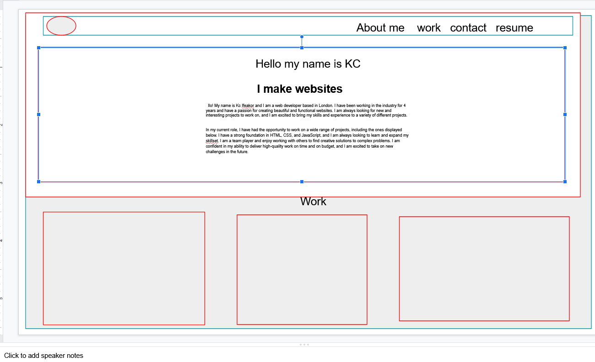
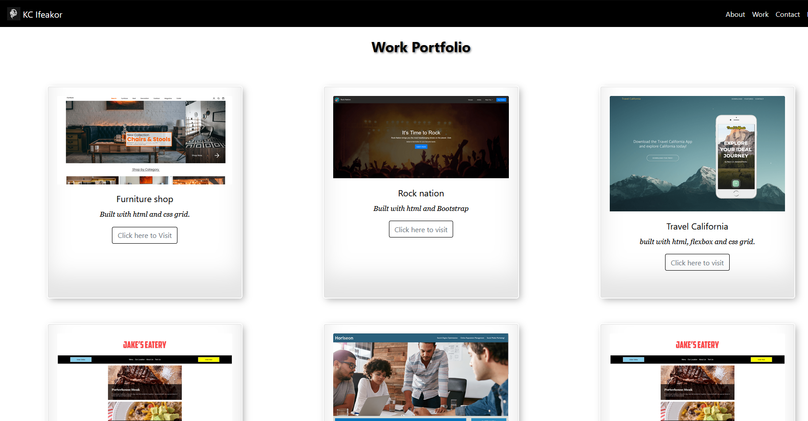
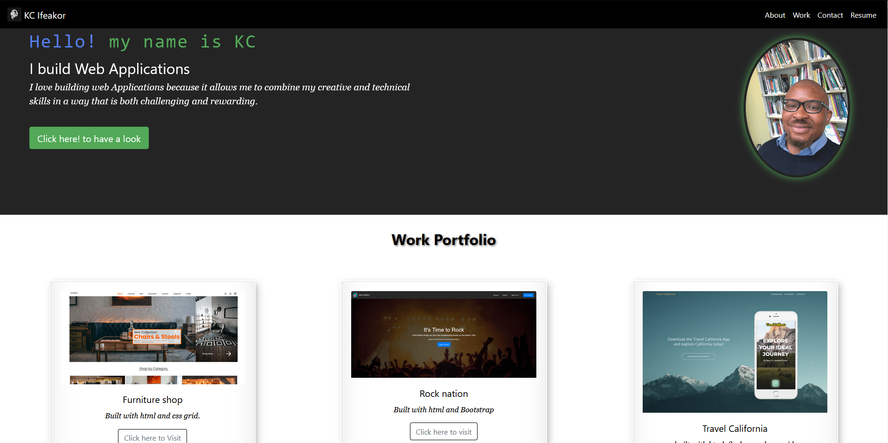
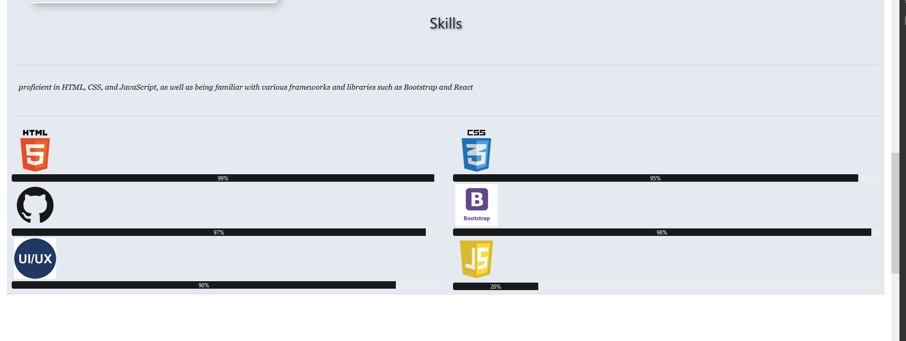
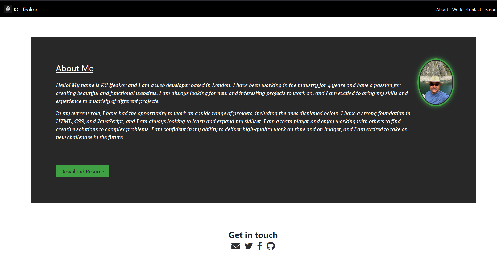

# My portfolio built using Bootstrap v4.6

## My Portfolio

Welcome to my portfolio! This project is a showcase of my frontend development skills, including my design process and completed projects

## Design Phase

I used google slides to create a wireframe of the project. I started by sketching out different sections of the page including Nav section, jumpotron and the work section.

I then created a color scheme and typography style to match my personal brand and give the portfolio a cohesive look. 

I used Bootsrap v4.6 as the foundation for the design of my portfolio, I used Bootstrap's grid system and components. I customised the style further using css and css variables as needed. 
lastly i added some interactive elements such as a typing animation the first time you load the page and also a hoover effect that makes projects card look bigger when you hoover on it. 

## project cards

the project cards shown below showcase my completed projects, including a brief description of the technology used to build the project and a button that link to view the project live. I have included projects that demonstrated my skills in HTML, CSS and responsive design

## Contact Page 

the contact page includes links to my socail media that allows visitors to get in touch with me 

## Final Thoughts

I hope you enjoy exploring my portfolio. If you have any questions or would like to work with me, please don't hesitate to reach out through the contact form or any of my social media profiles. Thank you for visiting!

This site is deployed using [GitHub Pages](https://pages.github.com/) at https://kifeakor22.github.io/bootstrap-portfolio/

project 

